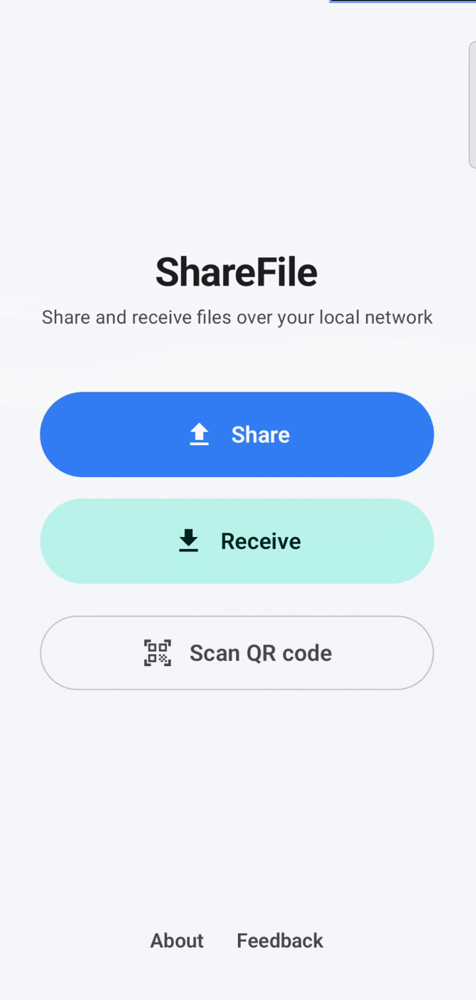
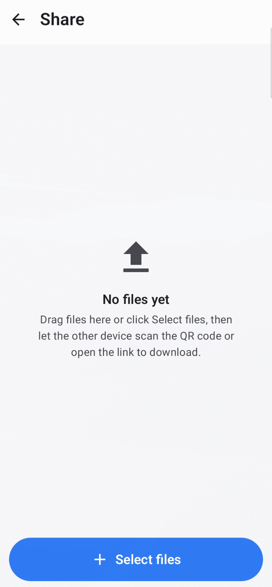
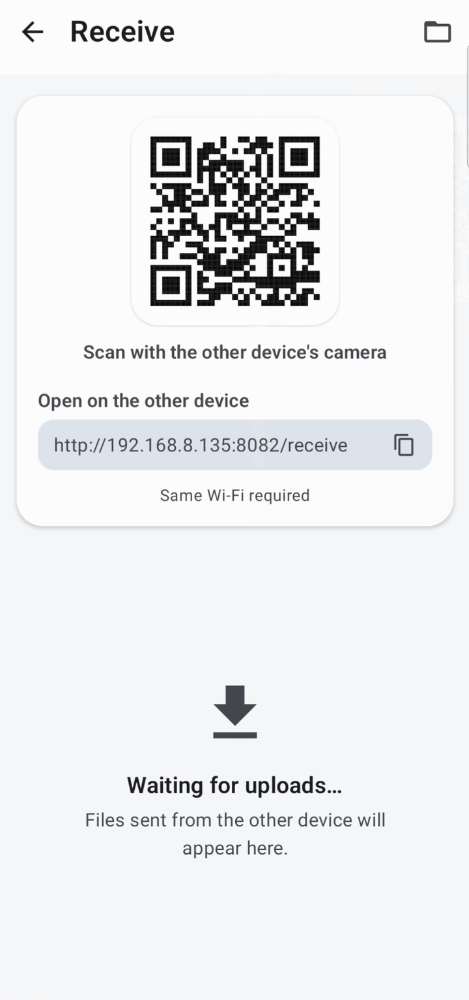
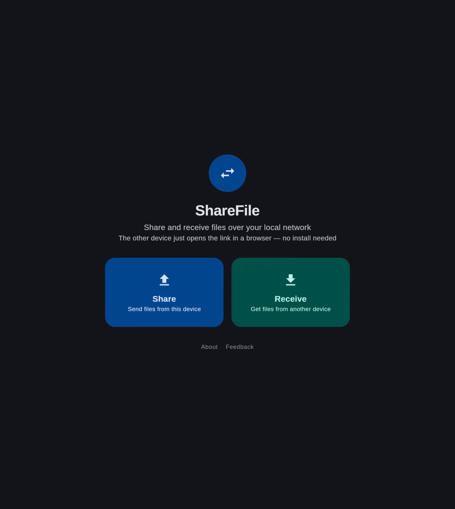
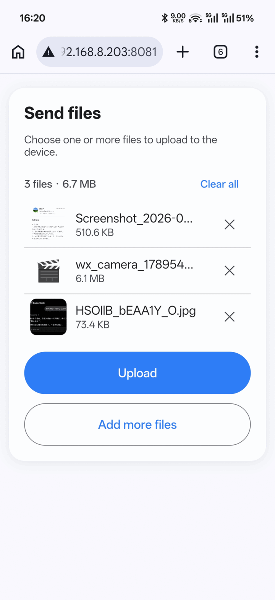

# Quick File Share — 局域网文件互传（Android 与桌面端）

[English](README.md) | **简体中文**

[](https://github.com/xechoz/quick-file-share/actions/workflows/build.yml)
[](https://github.com/xechoz/quick-file-share/releases)
[](LICENSE)

Quick File Share 是一款免费、开源的**局域网（LAN/Wi-Fi）文件互传工具**，支持 **Android 和桌面端**
（Linux、Windows、macOS）。对方设备**无需安装任何 App**——只要用浏览器打开链接，或扫描二维码即可。
无需账号、不经过云端、不依赖互联网连接。

定位与 [LocalSend](https://localsend.org/)、AirDrop 类似，但只专注于两件事：**发送（Share）**和
**接收（Receive）**。基于 [Compose Multiplatform](https://www.jetbrains.com/lp/compose-multiplatform/) 构建。

➡️ **官网与下载：<https://xechoz.github.io/quick-file-share/>**

## 截图

| Android | 发送文件 | 接收文件 |
|:-------:|:-----:|:-------:|
|  |  |  |

| 桌面端 | 浏览器 |
|:-------:|:-------:|
|  |  |
| 桌面端发送与接收 | 对方设备用浏览器打开链接即可，无需安装 |

## 功能

- **发送文件** —— 选择文件，启动内置 HTTP 服务，展示二维码 / 链接。对方打开链接即可下载。
- **接收文件** —— 启动内置 HTTP 服务并展示二维码 / 链接。对方打开链接即可把文件上传到你的设备。
- **扫码** —— 扫描对方设备的二维码，直接在 App 内浏览并下载其共享文件。*仅 Android；无摄像头的平台会隐藏该按钮。*
- **跨平台** —— Android、Linux、Windows、macOS 共用同一套局域网传输协议。
- **对方零安装** —— 任何有浏览器的设备都能收发文件。
- **隐私优先** —— 文件只在局域网内点对点传输，不会上传到任何服务器。

发送与接收在 Android 和桌面端都可用；扫码仅 Android 支持，桌面端会显示说明文字而非相机预览。

## 工作原理

App 内嵌一个轻量 HTTP 服务（[NanoHTTPD](https://github.com/NanoHttpd/nanohttpd)），绑定在本机的局域网地址上。

| 模式 | URL | 用途 |
|------|-----|------|
| 发送 | `http://<ip>:<port>/share` | 浏览器中列出可下载文件 |
| 接收 | `http://<ip>:<port>/receive` | 浏览器中的上传表单 |
| API | `http://<ip>:<port>/api/files` | JSON 文件列表（App 内扫码用） |
| 下载 | `http://<ip>:<port>/download/<id>` | 文件流 |

服务优先使用端口 `8080`，若被占用则回退到 `8081`–`8088`，便于针对固定端口段配置防火墙规则。

二维码由 [ZXing](https://github.com/zxing/zxing) 生成；Android 端扫码使用 CameraX + ML Kit。

### 防火墙

桌面系统防火墙默认会拦截入站连接，导致对方无法打开链接。检测到这种情况时，发送/接收页面会显示一张
**允许通过防火墙** 按钮的卡片。规则限定在本地子网内，同时会展示完整命令以便手动执行。

| 平台 | 处理方式 |
|----------|-------------------|
| Linux / ufw | `pkexec ufw allow from <subnet> to any port <port> proto tcp` |
| Linux / firewalld | `pkexec firewall-cmd --permanent --add-rich-rule=...`（限定子网） |
| Windows | 提权 `netsh advfirewall` 规则（限定子网） |
| macOS | 系统「允许传入连接」提示；尽力通过 `socketfilterfw` 放行 |

Android 没有主机防火墙，因此不会显示该卡片。

## 常见问题

### 两台设备都要安装 App 吗？

不需要。只有启动发送或接收的那台设备运行 Quick File Share。对方只需要一个浏览器——打开链接或扫描
二维码即可下载或上传文件。

### 离线能用吗？

可以。文件通过局域网直接传输，不需要互联网连接，也不需要云端账号。

### 它是 LocalSend 的替代品吗？

是的。与 LocalSend 类似，它同样是免费、开源、跨平台的局域网传输工具。区别在于侧重点：Quick File
Share 聚焦收发流程，并让接收方直接用浏览器完成操作，而不必安装 App。

### 安全吗？

文件不会离开你的局域网，直接从一台设备传到另一台。内置服务只监听局域网地址，关闭发送/接收页面即停止。

### 支持哪些平台？

Android 8.0+（APK）、Linux（deb、rpm、Arch、便携包）、Windows（msi）、macOS（dmg）。

## 项目结构

项目拆分为三个模块：

| 模块 | 插件 | 内容 |
|--------|--------|----------|
| `:shared` | Kotlin Multiplatform + `com.android.kotlin.multiplatform.library` | 全部共享代码与 Compose UI |
| `:app` | `com.android.application` | Android 外壳：manifest、资源、Web 资源 |
| `:desktop` | Kotlin/JVM + Compose Desktop | 桌面端入口与打包 |

`:shared` 按 Compose Multiplatform 源集组织：

```
shared/src/
├── commonMain/     # 模型、领域接口、全部共享 Compose UI、主题
├── jvmCommonMain/  # Android + 桌面端共享：HTTP 服务、HTTP 客户端、二维码矩阵、解析器
├── androidMain/    # Android 入口（MainActivity）、MediaStore/SAF/FileProvider、CameraX + ML Kit 扫码
├── desktopMain/    # 桌面端平台实现（文件系统存储、AWT 文件选择器、Skia 图片解码）、Web 资源
├── commonTest/     # 纯逻辑测试
└── jvmCommonTest/  # JVM 共享测试（在 Android host test 与桌面测试上运行）
```

`:app` 不含 Kotlin 代码：它只在 manifest 中声明 `MainActivity`（定义在 `:shared`），并提供 Android
资源与 Web 资源。

平台能力通过接口反转（`FileServer`、`FileDownloader`、`PlatformServices`），UI 级集成
（文件选择器、扫码、图片加载、返回处理）使用 `expect`/`actual`，使共享 UI 在功能不可用时优雅降级。

## 环境要求

- Android 8.0（API 26）及以上
- 桌面端：JDK 17 及以上
- 两台设备处于同一局域网

## 构建

```bash
./gradlew assembleDebug
```

Debug APK 输出到 `app/build/outputs/apk/debug/app-debug.apk`。

### 在桌面端运行

```bash
./gradlew :desktop:run
```

为当前系统打包原生安装包：

```bash
./gradlew :desktop:packageDistributionForCurrentOS
```

### Linux 安装包

Linux 包为精简版：不内置 JRE，依赖系统 Java 17+（由包管理器自动安装）。

```bash
bash desktop/packaging/build-linux-packages.sh
```

脚本会构建便携暂存目录（`:desktop:slimDist`），并在 `desktop/build/dist/` 下生成 `deb`、`rpm`
与 Arch 包。

### 发布构建

发布版本使用仓库外的 keystore 签名。在项目根目录创建 `keystore.properties`（已被 git 忽略）：

```properties
storeFile=/absolute/path/to/your.jks
storePassword=...
keyAlias=...
keyPassword=...
```

然后：

```bash
./gradlew assembleRelease
```

若 `keystore.properties` 不存在，发布构建会回退到 debug 签名配置，保证开箱即可构建。

## 测试

```bash
./gradlew :shared:desktopTest :shared:testAndroidHostTest
```

## 技术栈

- Kotlin Multiplatform + Compose Multiplatform（Material 3）
- NanoHTTPD —— 内嵌 HTTP 服务（共享 JVM 代码）
- ZXing —— 二维码生成（共享 JVM 代码）
- CameraX + ML Kit —— QR 扫码（Android）
- `HttpURLConnection` —— App 内下载客户端

## 说明

`:shared` 使用新的 `com.android.kotlin.multiplatform.library` 插件而非 `androidTarget()`。AGP 9
不支持在同一模块中与 `com.android.application` 并用 `androidTarget()`，因此 Android 应用位于
`:app`，共享 KMP 代码位于 `:shared`。

## 许可证

[MIT](LICENSE)
